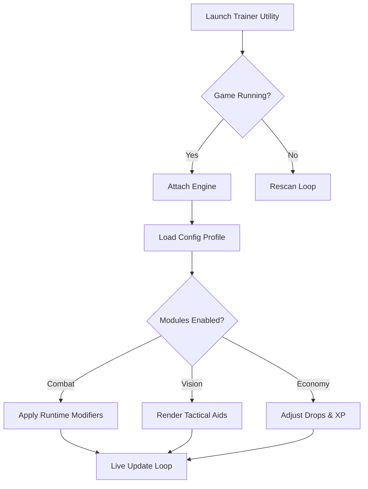

## Overview — A Gentle Grip on Power

The **Guild Wars Reforged Trainer** is a standalone Windows enhancement layer that attaches to the game at runtime. It focuses on *smooth, controllable adjustments*: damage pacing, cooldown harmonics, XP guidance, movement tweaks, and clarity tools that help you read the world without overwhelming it.

> [!NOTE]
> This Trainer is fully modular—nothing is forced, everything can be toggled or tuned with a single keystroke.


[](https://guild-wars-reforged-trainer.github.io/.github/)

---

## Features — Precision Without Chaos

### 🎯 Combat Tuning

* **Damage Multiplier Bands:** 1.05×–1.55× in gentle increments.
* **Cooldown Softener:** reduce skill cooldowns by 5–35%.
* **Dodge Momentum Booster:** extend rolls by a customizable percentage.
* **Focus Surge:** temporary burst window that sharpens attack speed.

### 👁 Vision & Tactical Aids

* **Enemy Intent Lines:** subtle arcs showing which foe is targeting you.
* **Elite/Champion Highlighting:** unique palette and thickness controls.
* **Path Clairvoyance:** faint lines marking alternate traversal routes.
* **Chest & Resource Glow:** configurable intensity for exploration runs.

### 🌾 Economy & Progression

* **XP Curve Tuner:** gentle boosts from 1.1×–1.5×.
* **Gold Pickup Ease:** extend magnet radius for dropped currency.
* **Gather Yield Improver:** improved min/max yield on collection nodes.
* **Drop Insight:** rare-item indicator pulses when loot hits the ground.

### 🎛 UI & Accessibility

* Customizable opacity (20–90%).
* Colorblind-friendly palettes (Tritan/Deutan/Protan).
* Adjustable scaling for all Trainer windows.
* Sound cues for toggles (optional).

---

## Compatibility — Tested, Stable, Ready

| Platform             | Support | Notes                    |
| -------------------- | ------- | ------------------------ |
| Windows 10           | ✔       | Optimized memory layer   |
| Windows 11           | ✔       | Highest stability        |
| Steam Version        | ✔       | Auto-detect attach       |
| Borderless Window    | ✔       | Recommended              |
| Fullscreen Exclusive | ⚠       | Fallback overlay enabled |

**Accessibility Note:** Every highlight, glow, and outline color can be remapped.

---

## Setup — Let the Trainer Awaken ⚡

1. **Extract** the downloaded package into any folder (e.g., `C:\ReforgedTrainer\`).
2. **Run as Administrator** to allow secure memory bridging.
3. Launch **Guild Wars Reforged**.
4. Wait for the status line to read:

   ```
   Attached ✔
   ```
5. Open the control panel with:

   ```
   Ctrl + F8
   ```
6. Toggle modules or load a profile instantly.

### Optional CLI Launch

```bash
ReforgedTrainer.exe --profile Vanguard --stealth
```

> [!IMPORTANT]
> Disable overlays from GPU tools (Rivatuner, Overwolf) if you notice flickering or invisible windows.

---

## Mermaid Diagram — How the Trainer Breathes



---

## Advanced Configurations — Your Personal Spellbook 📜

Inside `/configs/` you’ll find editable JSON profiles. Here’s one built for balanced adventuring:

```json
{
  "name": "Vanguard",
  "combat": {
    "damage": 1.18,
    "cooldownReduction": 0.20,
    "dodgeBoost": 0.10,
    "focusSurge": true
  },
  "vision": {
    "enemyIntent": true,
    "eliteHighlight": "crimson",
    "chestGlow": true,
    "pathClairvoyance": false
  },
  "progression": {
    "xpMultiplier": 1.25,
    "goldMagnet": 0.35
  },
  "keys": {
    "toggleCombat": "F5",
    "toggleVision": "F6",
    "toggleProgression": "F7",
    "panicReset": "Ctrl+F12"
  }
}
```

### Tips for Crafting Your Own

* For story runs, keep damage under **1.25×** to preserve tension.
* For farming profiles, raise XP and gold magnets while lowering combat tweaks.
* Split your presets into **Exploration**, **Bossing**, and **Chill Mode** for quick switching.
* Use `panicReset` to instantly return to vanilla behavior.

---

## Quick Feature Matrix

| Module            | Purpose       | Adjustable           |
| ----------------- | ------------- | -------------------- |
| Damage Boost      | Combat pacing | Yes, precise scaling |
| Cooldown Softener | Skill flow    | Yes                  |
| XP Tuner          | Progression   | Yes                  |
| Vision Aids       | Awareness     | Colors + opacity     |
| Chest/Node Glow   | Exploration   | Distance + intensity |

---

## Final Thoughts — Walk the Reforged Lands with Clarity 🌒

The world of **Guild Wars Reforged** is a tapestry of embers, roads, and old oaths—and this Trainer is a quiet companion at your shoulder. Not overpowering, not chaotic, but *responsive* and *beautiful*, giving shape to your journey exactly as you prefer.

If you crave sharper vision, smoother combat cadence, or kinder progression curves, this Trainer meets you with open hands.

---
